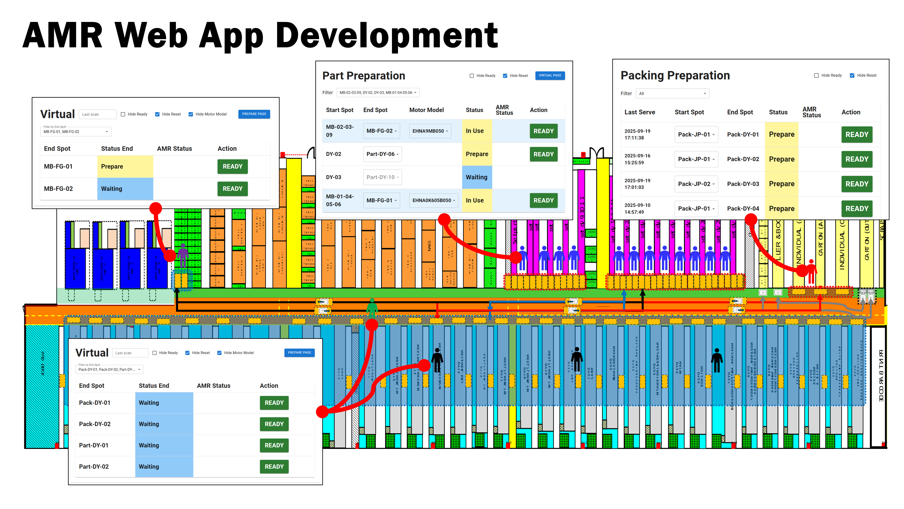

Overview

The AMR Project enables automated material handling within a manufacturing facility. The system allows workers to request autonomous carts from a web app on handheld devices or touchscreen terminals, while tracking AMR tasks in real-time.

Features

🚗 AMR commutes material carts between designated start and end points.

🌐 Web app interface for task creation and status monitoring.

📱 Handheld + touchscreen devices for user interaction.

⚙️ AMR hardware managed by RCS web application and configured via Walle app.

🔄 Web app communicates with AMR via API, with task and status stored in a MySQL database.

Technologies

AMR hardware + RCS (Robot Control System)

Walle Application (AMR setup/configuration)

Web App: React (developed in VS Code)

Backend: MySQL database + API integration

Development Tools: Postman, VS Code

Workflow

Worker selects start and end point via handheld or touchscreen device.

Web app sends task request via API to AMR system.

RCS executes AMR task, managed by Walle configuration.

Task progress and AMR status are updated in real-time in the web app.

How it works

Workers interact with AMR via a web app accessible on Panel PCs and handheld devices. The app shows AMR task requests, status updates, and ongoing operations. Panel PCs support start-point operations, while handheld devices are used at end points.

Part Handling

sequenceDiagram
    autonumber
    participant FE as Frontend (Pare)
    participant BE as Backend
    participant RCS as Robot API
    participant DB as MySQL
    participant CRON as Checker

    rect rgb(245,245,245)
      Note over FE: User presses “Ready” (Go: Start→End)
      FE->>BE: POST /api/pare-preparation/update-status {id, start_spot, end_spot, status_start}
      BE->>DB: Set status_start='Ready', status_end='Prepare'
      BE->>RCS: addTask(Start→End, orderId)
      RCS-->>BE: code=1000
      BE->>DB: Save taskid, taskdetail='created_start_spot'
    end

    rect rgb(235,250,255)
      Note over CRON: Every 5s
      CRON->>RCS: getTaskOrderStatus(orderId)
      alt subTaskStatus=1
        RCS-->>CRON: {1}
        CRON->>DB: start='Waiting', end='Ready'
      else subTaskStatus=3/5
        RCS-->>CRON: {3}
        CRON->>DB: start='Waiting', end='Prepare', taskdetail='Finish'
      end
    end

    rect rgb(245,245,245)
      Note over FE: Later, Return from Virtual page
      FE->>BE: POST /api/virtual-update-status {end_spot}
      BE->>DB: end='Ready', start='Prepare'
      BE->>RCS: addTask(End→Start, orderId2)
      RCS-->>BE: code=1000
      BE->>DB: taskdetail='created_end_spot'
    end

    rect rgb(235,250,255)
      Note over CRON: Every 5s
      CRON->>RCS: getTaskOrderStatus(orderId2)
      alt subTaskStatus=1
        RCS-->>CRON: {1}
        CRON->>DB: start='Waiting', end='Waiting'  %% Ready → Waiting (your missing detail)
      else subTaskStatus=3/5
        RCS-->>CRON: {3}
        CRON->>DB: start='Prepare', end='Waiting', taskdetail='Finish'
      end
    end

This diagram represents the standard Part Preparation (DY) process for both Go (Start → End) and Return (End → Start) phases.

Go Phase:

The operator marks a start location as Ready.

The backend calls the Robot API to send the cart to its end location.

While subTaskStatus=1, the UI shows “Going ⇒”.

When the robot finishes (subTaskStatus=3), the end spot becomes “Prepare” for the next cycle.

Return Phase:

Triggered from the Virtual page, reversing the path.

During travel (subTaskStatus=1), both Start and End are shown as “Waiting”.

When finished (subTaskStatus=3), the row resets to “Prepare + Waiting”.

This sequence forms the basic “pick & return” workflow for DY operations.

Motor Handling

sequenceDiagram
    autonumber
    participant FE as Frontend (Pare - MB)
    participant BE as Backend
    participant MEM as mem_location (FG-01/02)
    participant RCS as Robot API
    participant DB as MySQL
    participant CRON as Checker

    rect rgb(245,245,245)
      Note over FE: “Ready” (Go: MB-XX → MB-FG-0x)
      FE->>BE: POST /api/pare-preparation/update-status
      BE->>MEM: Reserve free FG (from_spot=<start>, id_partPrepare=<id>)
      BE->>DB: status_start='Ready' (or 'Empty' per your logic), status_end='Waiting'
      BE->>RCS: addTask(Start→FG, orderId)
      RCS-->>BE: code=1000
      BE->>DB: taskdetail='created_start_spot'
    end

    rect rgb(235,250,255)
      Note over CRON: Poll status
      CRON->>RCS: getTaskOrderStatus(orderId)
      alt 1
        RCS-->>CRON: {1}
        CRON->>DB: start='Waiting', end='Ready'
      else 3/5
        RCS-->>CRON: {3}
        CRON->>DB: start='Waiting', end='Prepare', taskdetail='Finish'
      end
    end

    rect rgb(245,245,245)
      Note over FE: “Return” on Virtual (FG-0x → MB-XX)
      FE->>BE: POST /api/virtual-update-status { end_spot=FG-0x }
      BE->>DB: end='Ready', start='Prepare'
      BE->>RCS: addTask(FG→Start, orderId2)
      RCS-->>BE: code=1000
      BE->>DB: taskdetail='created_end_spot'
    end

    rect rgb(235,250,255)
      Note over CRON: Poll status
      CRON->>RCS: getTaskOrderStatus(orderId2)
      alt 1
        RCS-->>CRON: {1}
        CRON->>DB: start='Waiting', end='Waiting' %% Ready → Waiting (Return in-progress)
      else 3/5
        RCS-->>CRON: {3}
        CRON->>MEM: Clear FG slot (from_spot=NULL, id_partPrepare=NULL)
        CRON->>DB: Promote MB queue (status_start='Queue' → 'In Use')
        CRON->>DB: For this row: start='In Use', end='Waiting', taskdetail='Finish'
      end
    end

MB (Motor Base) spots use FG-01 / FG-02 as shared output lanes, managed through the mem_location table.

When MB “Ready” is clicked:

The backend reserves one FG slot by writing from_spot and id_partPrepare into mem_location.

If both FG slots are busy, new MB tasks are marked Queue until a slot frees up.

The robot is commanded to move the cart (Go phase).

When the robot returns (subTaskStatus=3):

The checker clears the FG slot in mem_location.

Any queued MB rows are promoted (Queue → In Use).

The finished task’s status_start='In Use' and status_end='Waiting'.

This allows controlled concurrency and prevents both FG lanes from being used simultaneously.

Packing Material Handling
sequenceDiagram
    autonumber
    participant FE as Frontend (Packing)
    participant BE as Backend
    participant RCS as Robot API
    participant DB as MySQL
    participant CRON as Checker

    rect rgb(245,245,245)
      Note over FE: “Ready” (Go: selected_start_spot → end_spot)
      FE->>BE: POST /api/packing-preparation/update-status
      BE->>DB: this row: status_start='Ready' (or 'Empty'), set last_serve
      BE->>DB: other rows with same selected_start_spot → status_start='-'
      BE->>RCS: addTask(Start→End, orderId)
      RCS-->>BE: code=1000
      BE->>DB: taskdetail='created_start_spot'
    end

    rect rgb(235,250,255)
      Note over CRON: Poll
      CRON->>RCS: getTaskOrderStatus(orderId)
      alt 1
        RCS-->>CRON: {1}
        CRON->>DB: start='Waiting', end='Ready'
      else 3/5
        RCS-->>CRON: {3}
        CRON->>DB: start='Waiting', end='Prepare', taskdetail='Finish'
      end
    end

    rect rgb(245,245,245)
      Note over FE: “Return” from Virtual (End→Start)
      FE->>BE: POST /api/virtual-update-status { end_spot }
      BE->>DB: end='Ready', (pack) keep start as-is or Prepare
      BE->>RCS: addTask(End→Start, orderId2)
      RCS-->>BE: code=1000
      BE->>DB: taskdetail='created_end_spot'
    end

    rect rgb(235,250,255)
      Note over CRON: Poll
      CRON->>RCS: getTaskOrderStatus(orderId2)
      alt 1
        RCS-->>CRON: {1}
        CRON->>DB: start='Waiting', end='Waiting'  %% Ready → Waiting (Return in-progress)
      else 3/5
        RCS-->>CRON: {3}
        CRON->>DB: this row → start='Prepare', end='Waiting', taskdetail='Finish'
        CRON->>DB: OTHER rows with same selected_start_spot → promote to start='Prepare', end='Waiting'
      end
    end

The Packing flow is similar to Part (DY) but is grouped by selected start spot.

When an operator presses “Ready”, only one row per start spot can be active — other rows for that start spot are set to “-”.

The backend calls the Robot API and saves the new orderId.

During robot movement (subTaskStatus=1), statuses flip to “Waiting / Ready”.

When finished (subTaskStatus=3), the completed row becomes “Finish”, and the next one in the same start spot queue is promoted to Prepare.

This provides continuous packaging flow while ensuring only one active cart per loading zone.
