# AMR WebApp — Operations & API Flow

A web-based system for **Automated Mobile Robots (AMRs)** that moves carts between production points. Operators use a React UI to trigger moves, while an Express backend records state in MySQL and talks to the robot controller (RCS) via HTTP APIs.

> **Why this README?**  
> It explains **how the app works** (end-to-end data & robot flow), including API requests, the background status checker, and what each screen does. It also includes **Mermaid** diagrams and reference tables you can paste into GitHub.

---

## Contents

- [Overview](#overview)
- [Features](#features)
- [Technologies](#technologies)
- [System Overview](#system-overview)
- [Robot API at a glance](#robot-api-at-a-glance)
- [Poll Robot Status — Reference Table](#poll-robot-status--reference-table)
- [Part Handling (DY) — Go & Return](#part-handling-dy--go--return)
- [Motor Handling (MB) — Queue & mem_location](#motor-handling-mb--queue--mem_location)
- [Packing Material Handling — Go & Return](#packing-material-handling--go--return)
- [Glossary (DB columns & tables)](#glossary-db-columns--tables)
- [Mermaid & Assets Notes](#mermaid--assets-notes)

---

## Overview

The AMR Project enables automated material handling in a factory. Workers request moves from handhelds or panel PCs; the web app sends **tasks** to the robot controller and displays **live status**.

## Features

- 🚗 AMR moves carts between configured **start** and **end** points.
- 🌐 Web UI for **task creation** and **status monitoring**.
- 📱 Works on panel PCs (start stations) and handhelds (end stations).
- 🔌 Express backend + MySQL data store.
- 🤖 Robot controller (RCS) integration via HTTP **addTask** + **getTaskOrderStatus**.
- 🔄 Background **Task Status Checker** keeps DB/UI synced with the robot.

## Technologies

- **Frontend:** React (Create React App), Material UI
- **Backend:** Node.js + Express, MySQL (mysql2)
- **Robot API:** HTTP endpoints on RCS
- **Dev tools:** Postman, VS Code

---

## System Overview


Panel PCs and handhelds hit the same React UI. Operators press **Ready** to send a cart from **Start → End**, and later use the **Virtual** page to return it **End → Start**. Express records state in MySQL and talks to the robot controller (RCS).

---

## Robot API at a glance

```mermaid
sequenceDiagram
    autonumber
    participant BE as Backend (Express)
    participant RCS as Robot API

    Note over BE: Operator presses “Ready” → backend creates an orderId and sends a task
    BE->>RCS: POST /ics/taskOrder/addTask\n{ modelProcessCode, fromSystem, orderId,\n  taskOrderDetail:[{ taskPath: "<rcsStart>,<rcsEnd>" }] }
    RCS-->>BE: 200 OK\n{ code:1000, message:"Task created" }

    Note over BE,RCS: Background checker polls every 5s for the same orderId
    BE->>RCS: POST /ics/out/task/getTaskOrderStatus\n{ orderId:"<same orderId>" }
    alt success
        RCS-->>BE: { code:1000,\n  data:{ taskOrderDetail:[{ subTaskStatus: 1|3|5 }] } }
    else not found / error
        RCS-->>BE: { code:4xxx/5xxx, message:"..." }
    end
```



**Description:**  
Backend sends **addTask** when an operator clicks **Ready**. The **Task Status Checker** then polls **getTaskOrderStatus** every 5s using the same `orderId`. Your code treats `subTaskStatus=1` as **in progress**, and `3/5` as **finished**.

---

## Poll Robot Status — Reference Table

| Field | Example | Meaning |
|------|--------|---------|
| `code` | `1000` | API success |
| `orderId` | `1759824788424` | Unique task id set by backend |
| `data.taskOrderDetail[0].subTaskStatus` | `1` | **1 = Running**, **3/5 = Completed** |

**How checker updates DB (your logic):**

| taskdetail (phase) | `subTaskStatus` | `status_start` | `status_end` | `taskdetail` | Notes |
|---|---:|---|---|---|---|
| `created_start_spot` (Go: Start→End) | **1** | `Waiting` | `Ready` | _(keep)_ | “Going ⇒” visual |
| `created_start_spot` | **3/5** | `Waiting` | `Prepare` | `Finish` | Go complete |
| `created_end_spot` (Return: End→Start) | **1** | `Waiting` | `Waiting` | _(keep)_ | **Ready → Waiting** during return |
| `created_end_spot` | **3/5** | `Prepare` (MB: `In Use`) | `Waiting` | `Finish` | Return complete (+ MB side-effects) |

---

## Part Handling (DY) — Go & Return


**Description:**  
A full **Go → Return** cycle for **Part (DY)**. Go triggers `created_start_spot`; return triggers `created_end_spot`. The checker flips states on `1` (in-progress) and finalizes on `3/5` (complete).

---

## Motor Handling (MB) — Queue & `mem_location`

```mermaid
sequenceDiagram
    autonumber
    participant FE as Frontend (Pare - MB)
    participant BE as Backend
    participant MEM as mem_location (FG-01/02)
    participant RCS as Robot API
    participant DB as MySQL
    participant CRON as Checker

    rect rgb(245,245,245)
      Note over FE: “Ready” (Go: MB-XX → MB-FG-0x)
      FE->>BE: POST /api/pare-preparation/update-status
      BE->>MEM: Reserve FG slot (from_spot=<start>, id_partPrepare=<id>)
      BE->>DB: status_start='Ready' (or 'Empty'), status_end='Waiting'
      BE->>RCS: addTask(Start→FG, orderId)
      RCS-->>BE: code=1000
      BE->>DB: taskdetail='created_start_spot'
    end

    rect rgb(235,250,255)
      Note over CRON: Poll status
      CRON->>RCS: getTaskOrderStatus(orderId)
      alt 1
        RCS-->>CRON: {1}
        CRON->>DB: start='Waiting', end='Ready'
      else 3/5
        RCS-->>CRON: {3}
        CRON->>DB: start='Waiting', end='Prepare', taskdetail='Finish'
      end
    end

    rect rgb(245,245,245)
      Note over FE: “Return” on Virtual (FG-0x → MB-XX)
      FE->>BE: POST /api/virtual-update-status { end_spot=FG-0x }
      BE->>DB: end='Ready', start='Prepare'
      BE->>RCS: addTask(FG→Start, orderId2)
      RCS-->>BE: code=1000
      BE->>DB: taskdetail='created_end_spot'
    end

    rect rgb(235,250,255)
      Note over CRON: Poll status
      CRON->>RCS: getTaskOrderStatus(orderId2)
      alt 1
        RCS-->>CRON: {1}
        CRON->>DB: start='Waiting', end='Waiting'  %% Ready → Waiting during Return
      else 3/5
        RCS-->>CRON: {3}
        CRON->>MEM: Clear FG slot (from_spot=NULL, id_partPrepare=NULL)
        CRON->>DB: Promote MB queue (status_start='Queue' → 'In Use')
        CRON->>DB: For this row: start='In Use', end='Waiting', taskdetail='Finish'
      end
    end
```



**Description:**  
**MB** uses two FG lanes (`MB-FG-01/02`) tracked in `mem_location`. Go reserves a lane; Return completion frees it and promotes the next queued MB row.

---

## Packing Material Handling — Go & Return

```mermaid
sequenceDiagram
    autonumber
    participant FE as Frontend (Packing)
    participant BE as Backend
    participant RCS as Robot API
    participant DB as MySQL
    participant CRON as Checker

    rect rgb(245,245,245)
      Note over FE: “Ready” (Go: selected_start_spot → end_spot)
      FE->>BE: POST /api/packing-preparation/update-status
      BE->>DB: this row: status_start='Ready' (or 'Empty'), set last_serve
      BE->>DB: other rows with same selected_start_spot → status_start='-'
      BE->>RCS: addTask(Start→End, orderId)
      RCS-->>BE: code=1000
      BE->>DB: taskdetail='created_start_spot'
    end

    rect rgb(235,250,255)
      Note over CRON: Poll
      CRON->>RCS: getTaskOrderStatus(orderId)
      alt 1
        RCS-->>CRON: {1}
        CRON->>DB: start='Waiting', end='Ready'
      else 3/5
        RCS-->>CRON: {3}
        CRON->>DB: start='Waiting', end='Prepare', taskdetail='Finish'
      end
    end

    rect rgb(245,245,245)
      Note over FE: “Return” from Virtual (End→Start)
      FE->>BE: POST /api/virtual-update-status { end_spot }
      BE->>DB: end='Ready', (pack) start set to 'Prepare' (or leave as-is by variant)
      BE->>RCS: addTask(End→Start, orderId2)
      RCS-->>BE: code=1000
      BE->>DB: taskdetail='created_end_spot'
    end

    rect rgb(235,250,255)
      Note over CRON: Poll
      CRON->>RCS: getTaskOrderStatus(orderId2)
      alt 1
        RCS-->>CRON: {1}
        CRON->>DB: start='Waiting', end='Waiting'  %% Ready → Waiting during Return
      else 3/5
        RCS-->>CRON: {3}
        CRON->>DB: this row → start='Prepare', end='Waiting', taskdetail='Finish'
        CRON->>DB: OTHER rows with same selected_start_spot → promote to start='Prepare', end='Waiting'
      end
    end
```



**Description:**  
Only **one active row per start spot**. After Go finishes, the next row for that start spot is **promoted** to `Prepare` for continuous flow.

---

## Glossary (DB columns & tables)

- **status_start / status_end** — cell statuses shown in UI. Common values: `Prepare`, `Ready`, `Waiting`, `Empty`, `In Use`, `-` (disabled).
- **taskdetail** — phase marker: `created_start_spot` (Go), `created_end_spot` (Return), `Finish` (completed).
- **part_prepare / pack_prepare** — operational rows for Part and Packing.
- **mem_location** — FG lane occupancy for MB (`from_spot`, `destination_spot`, `id_partPrepare`).
- **location_name** — human spot name ↔ `rcs_name` mapping.

---

## Mermaid & Assets Notes

- GitHub renders Mermaid fenced blocks automatically:
  ```markdown
  ```mermaid
  sequenceDiagram
    A->>B: Hello
  ```
  ```
- Store images under `assets/` or `docs/images/` and reference with a relative path, e.g.:
  ```markdown
  
  ```

---

> If you want an **API Endpoints** section with example requests/responses for your app routes (e.g. `/api/pare-preparation/update-status`, `/api/virtual-update-status`, etc.), say the word and we’ll add it right below.
