# Overview

The AMR Project enables automated material handling within a manufacturing facility. The system allows workers to request autonomous carts from a web app on handheld devices or touchscreen terminals, while tracking AMR tasks in real-time.

---

# Features

- 🚗 AMR commutes material carts between designated start and end points.

- 🌐 Web app interface for task creation and status monitoring.

- 📱 Handheld + touchscreen devices for user interaction.

- ⚙️ AMR hardware managed by RCS web application and configured via Walle app.

- 🔄 Web app communicates with AMR via API, with task and status stored in a MySQL database.

---

# Technologies

- AMR hardware + RCS (Robot Control System)

- Walle Application (AMR setup/configuration)

- Web App: React (developed in VS Code)

- Backend: MySQL database + API integration

- Development Tools: Postman, VS Code

---

# Workflow

- Worker selects start and end point via handheld or touchscreen device.

- Web app sends task request via API to AMR system.

- RCS executes AMR task, managed by Walle configuration.

- Task progress and AMR status are updated in real-time in the web app.

---

# How it works

## System Overview

Workers interact with AMR via a web app accessible on Panel PCs and handheld devices. The app shows AMR task requests, status updates, and ongoing operations. Panel PCs support start-point operations, while handheld devices are used at end points.

---

## System Architecture

- RCS (Robot Control System) manages AMR hardware, maps, and task configurations.
- Walle application used for configuration and setup.
- Web App communicates with AMR via API, storing state in a MySQL database linked to user commands.
- Development tools: React (front-end), Postman, and VS Code for API and system testing.

---
## Architecture Diagram

## System Components

### 1. Frontend Layer (Port 3001)

The frontend is built with React and consists of five main modules that communicate with the backend via Axios HTTP requests:

#### **ParePreparation.js**
Manages the part preparation workflow including:
- Fetching current preparation status
- Updating selected end spots for parts
- Managing motor model selection and updates
- Controlling preparation status (start/stop/complete)
- Resetting troubleshooting states

#### **Virtual.js**
Handles virtual/simulation mode operations:
- Retrieving virtual data for simulation
- Updating virtual operation status
- Resetting troubleshooting states

#### **PickingPreparation.js**
Controls the packing preparation process:
- Fetching packing preparation status
- Setting start spot locations for packing
- Updating packing status
- Resetting troubleshooting states

#### **ManualControl.js**
Provides manual robot control capabilities:
- Fetching available locations
- Sending manual movement commands to the robot

#### **Troubleshooting.js**
Diagnostic and troubleshooting interface:
- Retrieving troubleshooting options
- Accessing part row data
- Accessing pack row data
- Resetting system states

### 2. Backend Layer (Express API - 172.16.16.210:3001)

The backend is built with Node.js and Express, serving as the middleware between the frontend and the Robot API. It consists of six main modules:

#### **parePreparation.js**
Express endpoints for part preparation:
- `GET /pare-preparation` - Retrieves preparation data
- `POST /pare-preparation/update-selected-end-spot` - Updates end spot selection
- `GET /motor-models` - Fetches available motor models
- `POST /pare-preparation/update-motor-model` - Updates motor model selection
- `POST /pare-preparation/update-status` - Updates status and triggers robot tasks

#### **virtualData.js**
Express endpoints for virtual operations:
- `GET /virtual-data` - Retrieves virtual operation data
- `POST /virtual-update-status` - Updates status and triggers robot tasks

#### **taskStatusChecker.js**
Background service that monitors robot task execution:
- Polls the Robot API to check task order status
- Updates internal database with task progress

#### **packingPreparation.js**
Express endpoints for packing operations:
- `GET /packing-preparation` - Retrieves packing data
- `POST /packing-preparation/update-selected-start-spot` - Updates start spot
- `POST /packing-preparation/update-status` - Updates status and triggers robot tasks

#### **manualControl.js**
Express endpoints for manual robot control:
- `GET /locations` - Retrieves available locations
- `POST /manual-control/move` - Sends movement commands to robot

#### **troubleshooting.js**
Express endpoints for diagnostics:
- `GET /troubleshooting/options` - Retrieves troubleshooting options
- `GET /troubleshooting/part-rows` - Fetches part row data
- `GET /troubleshooting/pack-rows` - Fetches pack row data
- `POST /troubleshooting/reset` - Resets system states

### 3. Robot API Layer (172.16.16.209:7000)

The external Robot Control System provides two main endpoints:

- `POST /ics/taskOrder/addTask` - Accepts task orders to control robot movements
- `POST /ics/out/task/getTaskOrderStatus` - Returns current status of task orders

## Data Flow

### Typical Request Flow

1. **User Interaction**: User interacts with a React component in the frontend
2. **HTTP Request**: Frontend makes an Axios HTTP request to the Express backend (port 3001)
3. **Backend Processing**: Express route handler processes the request:
   - Validates input data
   - Performs business logic
   - Updates database if needed
4. **Robot Command** (if applicable): Backend sends task orders to Robot API (port 7000)
5. **Status Monitoring**: `taskStatusChecker.js` polls Robot API for task completion
6. **Response**: Backend returns response to frontend
7. **UI Update**: Frontend updates the user interface based on response

## Technology Stack

- **Frontend**: React, Axios
- **Backend**: Node.js, Express
- **Robot Integration**: REST API (Axios)
- **Communication Protocol**: HTTP/REST

## Network Configuration

- **Frontend Server**: 172.16.16.210:3001 (serves React app and API)
- **Robot Controller**: 172.16.16.209:7000 (ICS Robot Control System)

## API Endpoints Summary

| Module | Frontend Route | Backend Route | Robot API |
|--------|---------------|---------------|-----------|
| Pare Preparation | `/api/pare-preparation/*` | `/pare-preparation/*` | `/ics/taskOrder/addTask` |
| Virtual | `/api/virtual-*` | `/virtual-*` | `/ics/taskOrder/addTask` |
| Packing | `/api/packing-preparation/*` | `/packing-preparation/*` | `/ics/taskOrder/addTask` |
| Manual Control | `/api/manual-control/*` | `/manual-control/*` | `/ics/taskOrder/addTask` |
| Troubleshooting | `/api/troubleshooting/*` | `/troubleshooting/*` | - |
| Status Checker | - | - | `/ics/out/task/getTaskOrderStatus` |

---
## Operation Flow
### Part Handling

```mermaid
sequenceDiagram
    autonumber
    participant FE as Frontend (Pare)
    participant BE as Backend
    participant RCS as Robot API
    participant DB as MySQL
    participant CRON as Checker

    rect rgb(245,245,245)
      Note over FE: User presses “Ready” (Go: Start→End)
      FE->>BE: POST /api/pare-preparation/update-status {id, start_spot, end_spot, status_start}
      BE->>DB: Set status_start='Ready', status_end='Prepare'
      BE->>RCS: addTask(Start→End, orderId)
      RCS-->>BE: code=1000
      BE->>DB: Save taskid, taskdetail='created_start_spot'
    end

    rect rgb(235,250,255)
      Note over CRON: Every 5s
      CRON->>RCS: getTaskOrderStatus(orderId)
      alt subTaskStatus=1
        RCS-->>CRON: {1}
        CRON->>DB: start='Waiting', end='Ready'
      else subTaskStatus=3/5
        RCS-->>CRON: {3}
        CRON->>DB: start='Waiting', end='Prepare', taskdetail='Finish'
      end
    end

    rect rgb(245,245,245)
      Note over FE: Later, Return from Virtual page
      FE->>BE: POST /api/virtual-update-status {end_spot}
      BE->>DB: end='Ready', start='Prepare'
      BE->>RCS: addTask(End→Start, orderId2)
      RCS-->>BE: code=1000
      BE->>DB: taskdetail='created_end_spot'
    end

    rect rgb(235,250,255)
      Note over CRON: Every 5s
      CRON->>RCS: getTaskOrderStatus(orderId2)
      alt subTaskStatus=1
        RCS-->>CRON: {1}
        CRON->>DB: start='Waiting', end='Waiting'  %% Ready → Waiting (your missing detail)
      else subTaskStatus=3/5
        RCS-->>CRON: {3}
        CRON->>DB: start='Prepare', end='Waiting', taskdetail='Finish'
      end
    end

```

**Description:**  
This diagram represents the standard Part Preparation (DY) process for both Go (Start → End) and Return (End → Start) phases.

**Go Phase:**

- The operator marks a start location as Ready.

- The backend calls the Robot API to send the cart to its end location.

- While subTaskStatus=1, the UI shows “Going ⇒”.

- When the robot finishes (subTaskStatus=3), the end spot becomes “Prepare” for the next cycle.

**Return Phase:**

- Triggered from the Virtual page, reversing the path.

- During travel (subTaskStatus=1), both Start and End are shown as “Waiting”.

- When finished (subTaskStatus=3), the row resets to “Prepare + Waiting”.

This sequence forms the basic “pick & return” workflow for DY operations.

---

### Motor Handling

```mermaid
sequenceDiagram
    autonumber
    participant FE as Frontend (Pare - MB)
    participant BE as Backend
    participant MEM as mem_location (FG-01/02)
    participant RCS as Robot API
    participant DB as MySQL
    participant CRON as Checker

    rect rgb(245,245,245)
      Note over FE: “Ready” (Go: MB-XX → MB-FG-0x)
      FE->>BE: POST /api/pare-preparation/update-status
      BE->>MEM: Reserve free FG (from_spot=<start>, id_partPrepare=<id>)
      BE->>DB: status_start='Ready' (or 'Empty' per your logic), status_end='Waiting'
      BE->>RCS: addTask(Start→FG, orderId)
      RCS-->>BE: code=1000
      BE->>DB: taskdetail='created_start_spot'
    end

    rect rgb(235,250,255)
      Note over CRON: Poll status
      CRON->>RCS: getTaskOrderStatus(orderId)
      alt 1
        RCS-->>CRON: {1}
        CRON->>DB: start='Waiting', end='Ready'
      else 3/5
        RCS-->>CRON: {3}
        CRON->>DB: start='Waiting', end='Prepare', taskdetail='Finish'
      end
    end

    rect rgb(245,245,245)
      Note over FE: “Return” on Virtual (FG-0x → MB-XX)
      FE->>BE: POST /api/virtual-update-status { end_spot=FG-0x }
      BE->>DB: end='Ready', start='Prepare'
      BE->>RCS: addTask(FG→Start, orderId2)
      RCS-->>BE: code=1000
      BE->>DB: taskdetail='created_end_spot'
    end

    rect rgb(235,250,255)
      Note over CRON: Poll status
      CRON->>RCS: getTaskOrderStatus(orderId2)
      alt 1
        RCS-->>CRON: {1}
        CRON->>DB: start='Waiting', end='Waiting' %% Ready → Waiting (Return in-progress)
      else 3/5
        RCS-->>CRON: {3}
        CRON->>MEM: Clear FG slot (from_spot=NULL, id_partPrepare=NULL)
        CRON->>DB: Promote MB queue (status_start='Queue' → 'In Use')
        CRON->>DB: For this row: start='In Use', end='Waiting', taskdetail='Finish'
      end
    end
```

**Description:**  
MB (Motor Base) spots use FG-01 / FG-02 as shared output lanes, managed through the mem_location table.

**When MB “Ready” is clicked:**

- The backend reserves one FG slot by writing from_spot and id_partPrepare into mem_location.

- If both FG slots are busy, new MB tasks are marked Queue until a slot frees up.

- The robot is commanded to move the cart (Go phase).

**When the robot returns (subTaskStatus=3):**

- The checker clears the FG slot in mem_location.

- Any queued MB rows are promoted (Queue → In Use).

- The finished task’s status_start='In Use' and status_end='Waiting'.

This allows controlled concurrency and prevents both FG lanes from being used simultaneously.

---

### Packing Material Handling

```mermaid
sequenceDiagram
    autonumber
    participant FE as Frontend (Packing)
    participant BE as Backend
    participant RCS as Robot API
    participant DB as MySQL
    participant CRON as Checker

    rect rgb(245,245,245)
      Note over FE: “Ready” (Go: selected_start_spot → end_spot)
      FE->>BE: POST /api/packing-preparation/update-status
      BE->>DB: this row: status_start='Ready' (or 'Empty'), set last_serve
      BE->>DB: other rows with same selected_start_spot → status_start='-'
      BE->>RCS: addTask(Start→End, orderId)
      RCS-->>BE: code=1000
      BE->>DB: taskdetail='created_start_spot'
    end

    rect rgb(235,250,255)
      Note over CRON: Poll
      CRON->>RCS: getTaskOrderStatus(orderId)
      alt 1
        RCS-->>CRON: {1}
        CRON->>DB: start='Waiting', end='Ready'
      else 3/5
        RCS-->>CRON: {3}
        CRON->>DB: start='Waiting', end='Prepare', taskdetail='Finish'
      end
    end

    rect rgb(245,245,245)
      Note over FE: “Return” from Virtual (End→Start)
      FE->>BE: POST /api/virtual-update-status { end_spot }
      BE->>DB: end='Ready', (pack) keep start as-is or Prepare
      BE->>RCS: addTask(End→Start, orderId2)
      RCS-->>BE: code=1000
      BE->>DB: taskdetail='created_end_spot'
    end

    rect rgb(235,250,255)
      Note over CRON: Poll
      CRON->>RCS: getTaskOrderStatus(orderId2)
      alt 1
        RCS-->>CRON: {1}
        CRON->>DB: start='Waiting', end='Waiting'  %% Ready → Waiting (Return in-progress)
      else 3/5
        RCS-->>CRON: {3}
        CRON->>DB: this row → start='Prepare', end='Waiting', taskdetail='Finish'
        CRON->>DB: OTHER rows with same selected_start_spot → promote to start='Prepare', end='Waiting'
      end
    end
```

**Description:** 
The Packing flow is similar to Part (DY) but is grouped by selected start spot.

- When an operator presses “Ready”, only one row per start spot can be active — other rows for that start spot are set to “-”.

- The backend calls the Robot API and saves the new orderId.

- During robot movement (subTaskStatus=1), statuses flip to “Waiting / Ready”.

- When finished (subTaskStatus=3), the completed row becomes “Finish”, and the next one in the same start spot queue is promoted to Prepare.

This provides continuous packaging flow while ensuring only one active cart per loading zone.

---
